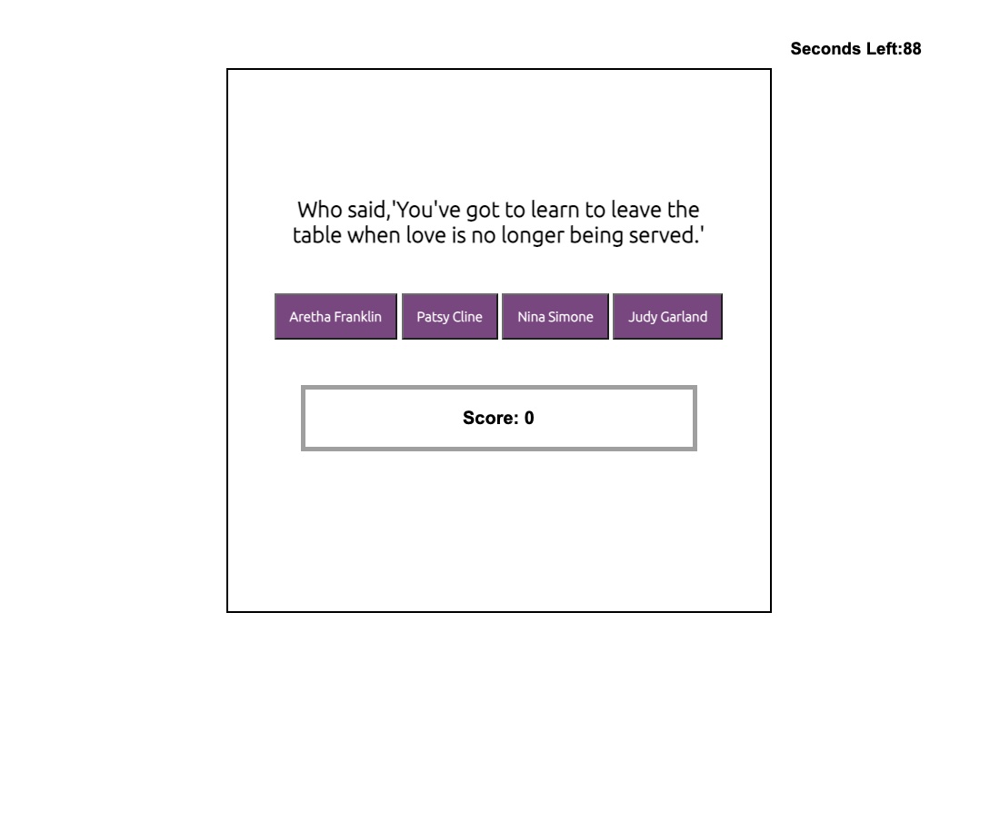

## code-quiz

## Project Description

This project entailed application development containing HTML, CSS and JavaScript code. Specifically, this project maintaiend heavy focus on the dynamic properties of JavaScript. 

## How to Run
Go to site: 

## How to Use

First, the user opens browser to the deployed site. Once the user clicks the "Start Challenge" button the timer will begin and the first question will appear. After the user selects one of four multiple choice options a message will appear to alert the user if their question was incorrect/correct. If correct the timer remains unaffected and the next question is presented. If incorrect, 10 seconds is deducted from the timer and the next question is presented. The quiz ends when the timer runs out or after all the questions have been answered. When one of those criteria is met, a "Next Step" button appears that, when clicked, will send the user to a page where they are prompted to enter their initials.

## Known Bugs

Currently, the last question will allow the user to continue to click multiple choice buttons. Although, this doesn't impact the score or the timer it does preclude a seamless transition to the initials input page. A temprorary workaround has been placed in form of the "Next Step" button which will transition the user to the next page. Another issue is the inability to loccaly store the user intials input which is preventing the retrieval of user initials for the final page. Lastly, the start over and reset features options are not present.

